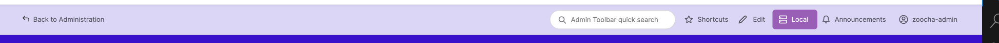

# Zoocha Admin Theme Recipe Installation Guide

To install the Zoocha Admin Theme recipe, follow the steps below:

1. Open your terminal.
2. Navigate to your project directory. 
3. Add the below in the Drupal Root's composer.json installer-paths
```sh
"web/recipes/custom/{$name}": ["type:drupal-custom-recipe"]
```
4. Run the following command:

    ```sh
    ddev drush recipe recipes/custom/zr-admin-theme-starter-recipe
    ```

This command will execute the Zoocha Admin Theme recipe installation.

These commands will install the necessary modules for the Zoocha Admin Theme.

Additionally, you should add the environment indicator settings in `settings.php` based on the environment:

```php
 $config['environment_indicator.indicator']['name'] = 'Dev';
 $config['environment_indicator.indicator']['bg_color'] = '#d8d887';

 $config['environment_indicator.indicator']['name'] = 'Stage';
 $config['environment_indicator.indicator']['bg_color'] = '#6eb6cb';

 $config['environment_indicator.indicator']['name'] = 'Live';
 $config['environment_indicator.indicator']['bg_color'] = '#e45656';
```
To ensure the environment indicator looks consistent, add the following CSS to your theme's custom CSS file:

```css
#toolbar-item-environment-indicator {
    border-radius: var(--gin-border-s) !important;
    color: #ffffff !important;
}
.gin-secondary-toolbar .toolbar-secondary .toolbar-bar .toolbar-tab #toolbar-item-environment-indicator.toolbar-item::before {
    background-color: #ffffff !important;
}
#toolbar-item-environment-indicator-tray {
    display: none !important;
}
#toolbar-item-administration-tray .toolbar-logo img {
    border-radius: 5px;
}
```
